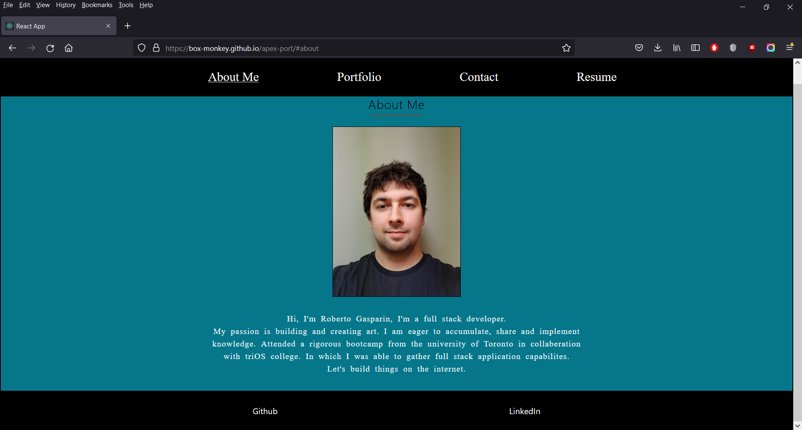

# apex-port

Apex-port

# Table of Contents

---

[Description](#Description)

[Installations](#Installations)

[Test](#Test)

[Live](#Live)

[Questions](#Questions)

# Description

Professional portfolio designed to showcase my completed projects and utilize the knowledge with React by creating 
reusable components throught entire application. 

# Installation

  React, gh-pages

# Test

    npm install, npm start

# Live  

https://box-monkey.github.io/apex-port/#about

# Questions

---

## Contact me here:

## Author

     Roberto Gasparin

## [Github](https://github.com/box-monkey)

## [Email](mailto:jr.gasparin15@gmail.com)

#

